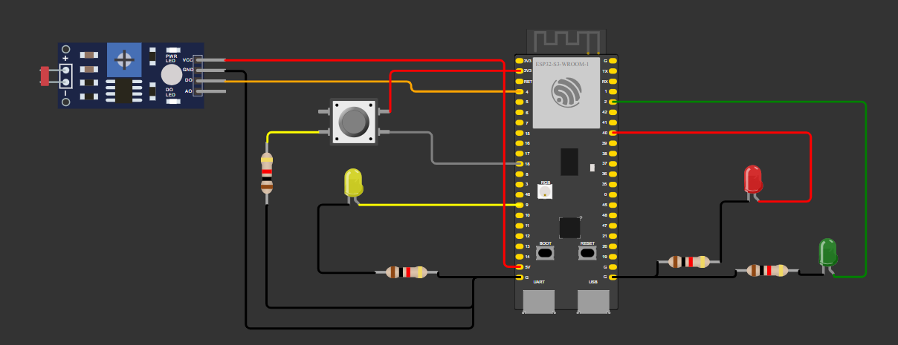
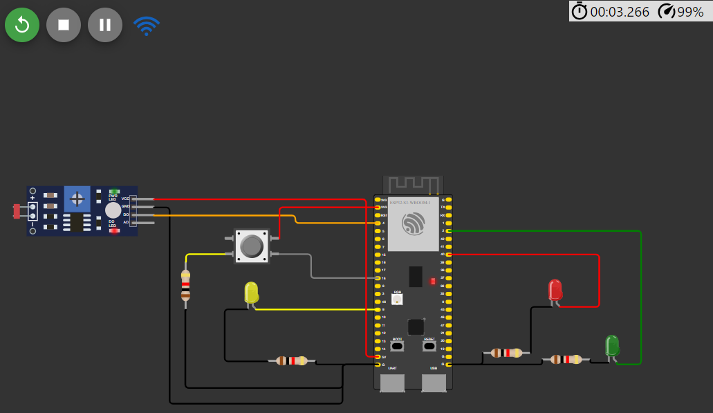

# exercicio-prova-marcelo

## Semáforo inteligente 

Essa é uma atividade desenvolvida pelo autor deste repositório para a prova do Módulo 4 do 1° ano do Inteli, consiste no desenvolvimento de de um semáforo inteligente pré feito, ou seja, tínhamos que corrijir um que já existia

<div align="center">
<sub>Figura 1 - Semáforo Inteligente</sub>

<sup>Fonte: Material produzido pelo autor (2024)</sup>
</div>

A atividade consistia em realizar 8 pontos principais, sendo eles

- 1) Todo o código deve estar padronizado para inglês ou português, incluindo comentários (1,0 ponto); 

- 2) Todas as entradas e saídas devem estar declaradas corretamente na inicialização (1,0 ponto);

- 3) Todos os leds devem estar apagados na inicialização (até 1,0 ponto);

- 4) Quando estiver escuro (segundo a leitura analógica do sensor LDR), o protótipo deve ativar o modo noturno e piscar o led amarelo a cada segundo (até 1,0 ponto);

- 5) Quando estiver claro (segundo a leitura analógica do sensor LDR), o protótipo deve ativar o modo convencional e fazer a temporização alternando entre verde (3 segundos), amarelo (2 segundos) e vermelho (5 segundos) (até 2,0 pontos);

- 6) Quando estiver claro (segundo a leitura analógica do sensor LDR) e o semáforo estiver no estado fechado (somente led vermelho aceso) e o botão for pressionado, o semáforo deve abrir 1 segundo após o pressionamento do botão (até 2,0 pontos);

- 7) O protótipo deve suportar debounce na leitura do botão (até 1,0 ponto);

- 8) Quando estiver claro (segundo a leitura analógica do sensor LDR) e o semáforo estiver no estado fechado (somente led vermelho aceso) e o botão for pressionado 3 vezes, você deve enviar uma requisição HTTP para implementar um alerta (realize uma requisição para o http://www.google.com.br/ para fins de teste) (até 1,0 ponto).

----

Os comentários do código estão em português e as entradas estão definidas no começo do código:

Segue um exemplo:
``` C++
#define led_verde 2 // Pino utilizado para controle do led verde
#define led_vermelho 40 // Pino utilizado para controle do led vermelho
#define led_amarelo 9 // Pino utilizado para controle do led amarelo

const int buttonPin = 18;  // Pino utilizado para o controle do botão
int buttonState = 0;  // Variável para ler o status do botão

const int ldrPin = 4;  // Pino utilizado para o controle do sensor LDR
const float limiarNoturno = 500; // Valor de limite para dia/noite

unsigned long previousMillis = 0;  // Variável para controle do tempo dos LEDs
int estado = 0; //Estado inicial do led
bool modoNoturno = false; //Define o modo noturno para que fique desligado naturalmente
```

Leds estão desligados durante a inicialização

<div align="center">
<sub>Figura 2 - Leds desligados durante a iniciação do programa</sub>

<sup>Fonte: Material produzido pelo autor (2024)</sup>
</div>